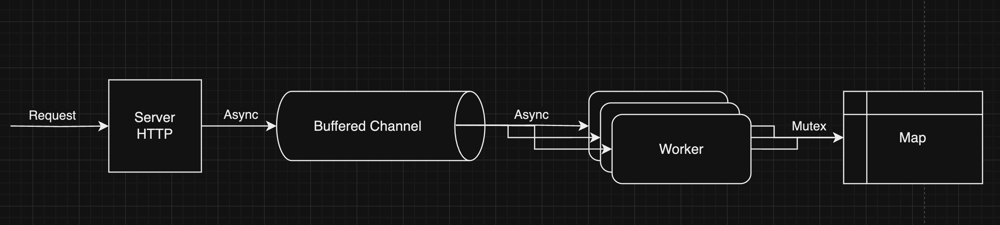

# Distributed Realtime Stats API



```
go run main.go
```

```
curl -X POST -H "Content-Type: application/json" -d '{"id": "usuario", "valor1": 5, "valor2": 3, "valor3": 10}' http://localhost:8080/calculo
```